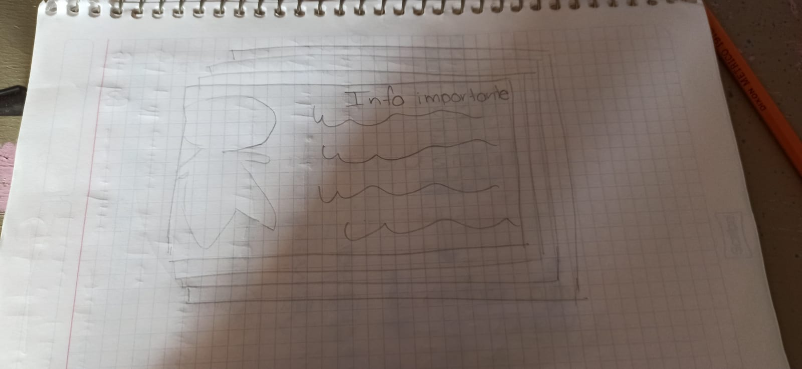
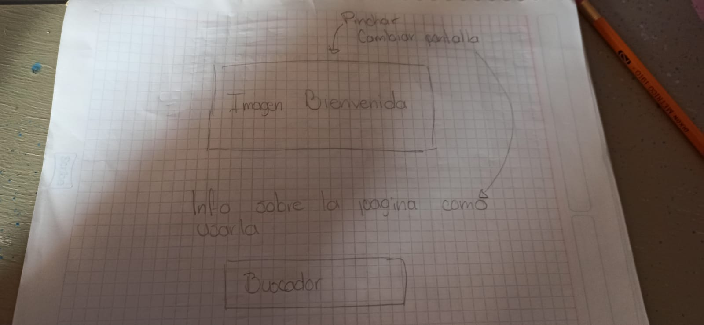
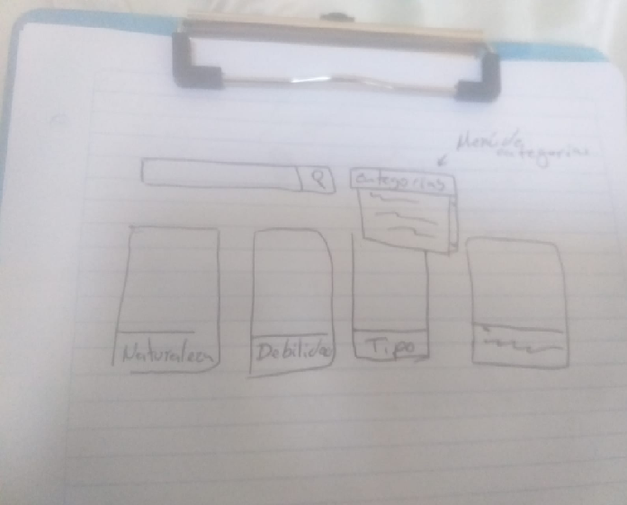
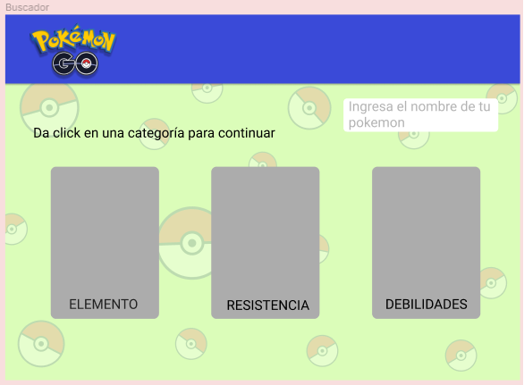
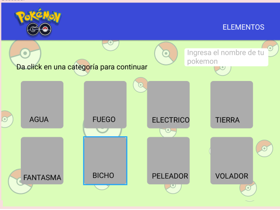
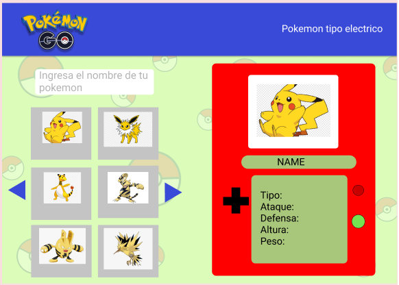

# Data Lovers

## Índice

* [1. Definición del producto](#1-definicion-del-proyecto)
* [2. Historias de usuario](#2-historias-de-usuario)
* [3. Sketch (Prototipo de baja fidelidad)](#3-sketch)
* [4. Prototipo de alta fidelidad](#4-Prototipo-de-alta-fidelidad)
* [5. Test de usabilidad](#5-Test-de-usabilidad)
* [6. Prototipo de acuerdo al test de usabilidad.](#6-Prototipo-de-acuerdo-al-test-de-usabilidad.)

***

## 1. Definición del proyecto
El objetivo de esta aplicacion es cubrir las necesidades de los usuarios que quieren conocer más sobre los Pokemon. Para desarrollar esta aplicacion se llevo a cabo una investigación por medio de una encuesta en la cual se obtuvieron los siguientes resultados: 

Categorías que los usuarios consideraron más importantes:
Tipo
Ataque
Nombre

Información relevante para los usuarios acerca de sus pokemones:
Fortalezas
Naturaleza/Habilidades
Debilidades

Presentación de la información: Tarjetas.
## 2. Historias de usuario
Con la informacion obtenida de la encuesta se obtuvieron 3 Historias de Usuario fundamentales para el desarrollo de la aplicación.

H1. Pokemon en pantalla principal

Como visitante quiero ver tarjetas de pokemon en la pantalla principal para
poder conocer nuevos pokemon. 

Criterios de aceptacion
Quiero ver las tarjetas de algunos pokemon en la pagina de inicio
Quiero que aparezca su nombre
Quiero que esten organizadas conforme al numero de pokemon
Al dar click en la tarjeta quiero que me direccione a la información del pokemon.

Definición de terminado
Se visualizan las tarjetas en la pagina principal de pokemon
Los pokemon aparecen ordenados de acuerdo al numero
Aparecen los nombres correspondientes a los pokemon
Al dar click redirecciona a la información del pokemon

H2. filtro por tipo
Cómo usuario quiero buscar los pokemon filtrados por elemento, 
para poder encontrar a los pokemon de un elemento en especifico.

Criterios de aceptacion
Que aparezcan los pokemon filtrados por tipo.
Quiero que se vea la foto del pokemon y el nombre en tarjetas.
Quiero que al dar click en la tarjeta pueda visualizar la información.

Definición de terminado 
El usuario puede filtrar el tipo mediante un menudesplegable
Se visualiza la foto del pokemon con el nombre en una tarjeta.
Se abre una ventana modal con la información del pokemon con un evento click.

H3. Buscador por nombre
Como UsuarioQuiero Poder buscar a los pokemon por medio de su nombre.  
Para poder encontrar a un determinado pokemon y su información

Criterios de aceptación 
Buscar por nombre
Que encuentre el pokemon independientemente si se usa minúsculas o mayúsculas
Recibir un mensaje si el pokemon no ha sido enconcontrado

Definición de terminado
Imprime pokemon filtrado por nombre
Imprime Pokémon aunque se ingresen mayúsculas y/o minúsculas en la busqueda.
Devuelve un mensaje de no encontrado en caso de que la informacion ingresada no coincida con la data.

## 3. Sketch (Prototipo de baja fidelidad)

## 4. Prototipo de alta fidelidad

link a Figma: https://www.figma.com/file/IM9uJuBPWNmwmQpP7zabZU/Data-Lovers

## 5. Test de usabilidad
-Manejar la app en una sola pantalla.
-Modificacion los botones de busqueda y filtrado.

## 6. Prototipo de acuerdo al test de usabilidad.

Primera actualización

Ultima actualización

